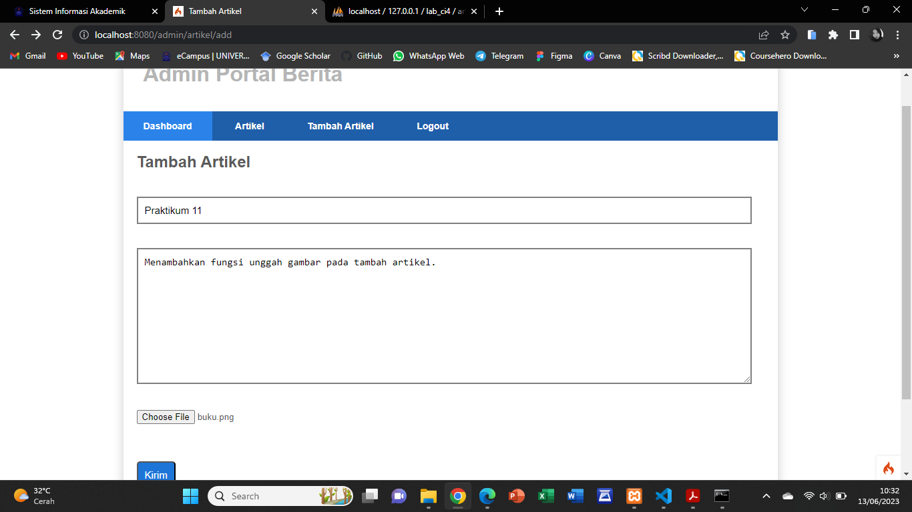
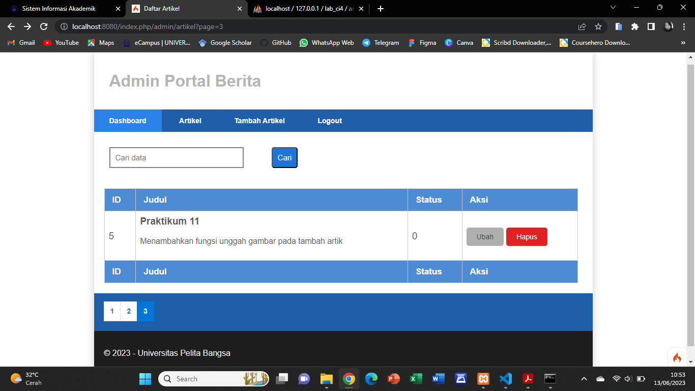
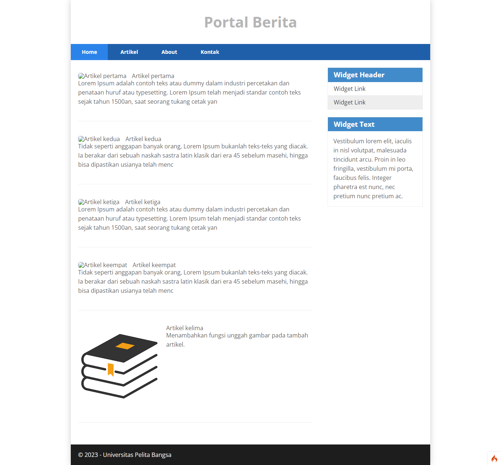

# Praktikum 11 - Upload File Gambar

## Upload Gambar pada Artikel

Menambahkan fungsi unggah gambar pada tambah artikel.

* Buka kembali **Controller Artikel** pada project sebelumnya, sesuaikan kode pada method **add** seperti berikut:

    ```php
        public function add()
        {
        // validasi data.
        $validation = \Config\Services::validation();
        $validation->setRules(['judul' => 'required']);
        $isDataValid = $validation->withRequest($this->request)->run();
        
        if ($isDataValid)
        {
            $file = $this->request->getFile('gambar'); 
            $file->move(ROOTPATH . 'public/gambar');

            $artikel = new ArtikelModel();
            $artikel->insert([
                'judul' => $this->request->getPost('judul'),
                'isi' => $this->request->getPost('isi'),
                'slug' => url_title($this->request->getPost('judul')),
                'gambar' => $file->getName(),
            ]);
            return redirect('admin/artikel');
        }
        $title = "Tambah Artikel";
        return view('artikel/form_add', compact('title'));
        }
    ```

* Kemudian pada file **views/artikel/form_add.php** tambahkan field input file seperti berikut.

    ```html
        <p>
            <input type="file" name="gambar">
        </p>
    ```

* Dan sesuaikan tag form dengan menambahkan ecrypt type seperti berikut.

    ```html
        <form action="" method="post" enctype="multipart/form-data">
    ```

* Ujicoba file upload dengan mengakses menu tambah artikel.




* Maka hasilnya akan seperti berikut.







## Terimakasih! 